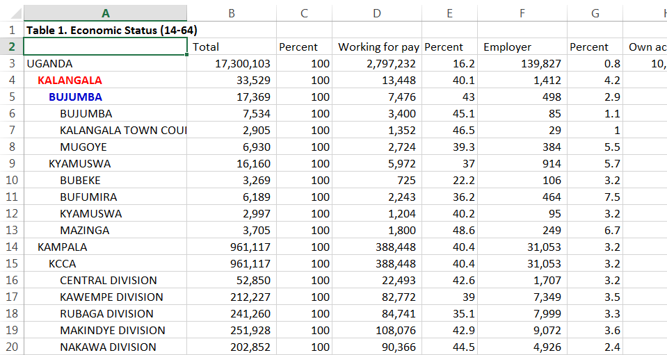
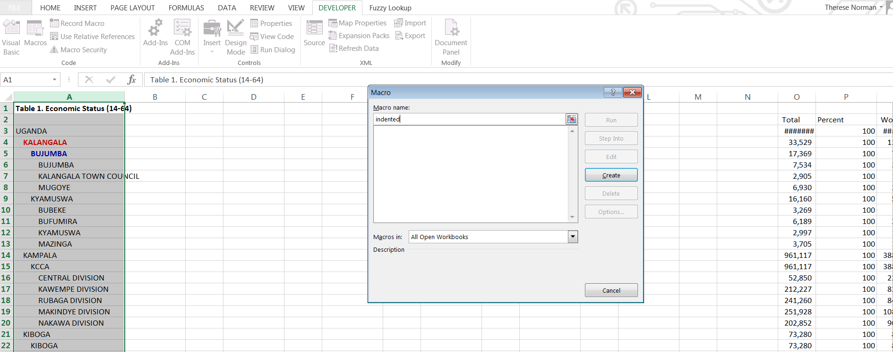
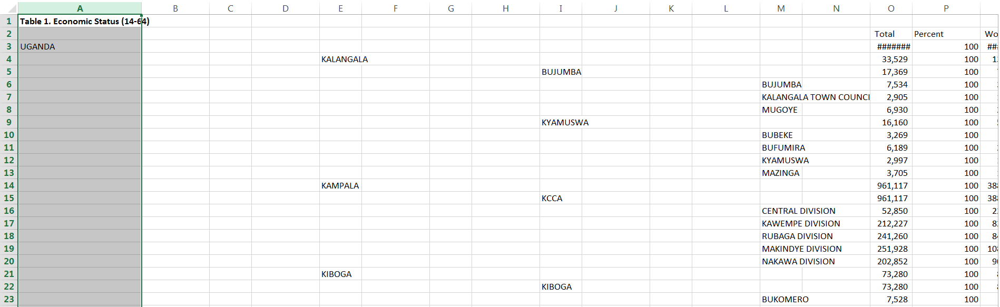
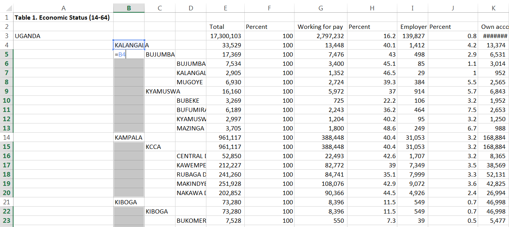
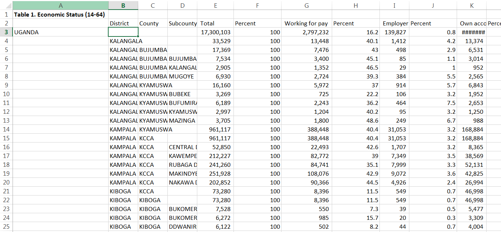

# Place indented data into separate columns and preserve hierarchy in Excel

### Purpose
This macro helps you restructure data in excel. It takes data that is indented according to a hierarchy and places it into separate columns.


### Script explanation
The original excel sheet looks like the screenshot below. The data is organized into a hierarchy by level of indent: First the country Uganda, then districts, then counties and then subcounties. I want the districts, counties and subcounties to be in separate columns for later analysis.  


First I move the data in all columns except for column A to the right, out of the way. Then I select column A, go to the Developer tab, click Macros in the Code section, name the macro 'indented' and click create.  


I add the following code into the code windown and click on the 'run' arrow.  
```Macro
Sub fixdata()
Dim cell as Range
Dim i as Long
for each cell in selection
i = len(cell) - len(ltrim(cell))
if i <> 0 then
cell.offset(0,i) = Trim(cell.Value)
cell.clearcontents
end if
Next
End Sub
```
The result looks like the screenshot below.

I delete the columns with empty space.

I also want the district and county cells to be filled down with repeated districts and counties. To do this I select the district name in cell B4 and all cells below. Click Home > Find & Select > Go To Special and check Blanks option. All the blanks cells will be selected after clicking OK. Then type the formula “=B4” into active cell B5 without changing the selection. Press Ctrl + Enter, Excel will copy the respective formula to all blank cells. I apply the same procedure to column C.


Since the filled contents in column B and C are formulas I need to convert the formulas to values by copying them, right-clicking and choosing 'paste to values'. I also add District, County and Subcounty headers.

Lastly, I sort the data in alphabetical order by subcounty and I delete all rows that don't have a subcounty, because I'm not interested in data aggregated to the district or county level at this point. I can always calculate that later from the subcounty data. Then I sort the data by district name.
The final spreadsheet looks like the screenshot below. This is the ideal format for analysis purposes. 

