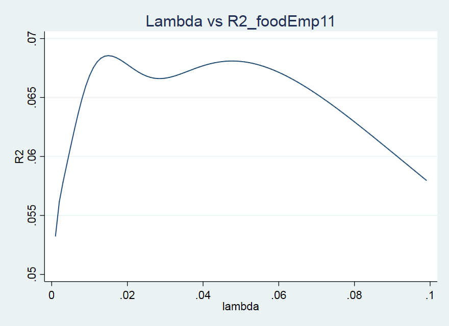
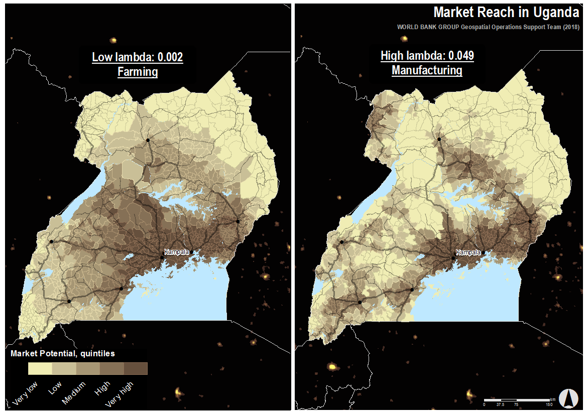

# Estimate distance discounting factor for market potential variables

### Purpose
This script is meant to be used as a complimentary process while calculating market potential variables (spatial aggregates of demand weighted by distance). It requires data on travel times between origins and destinations ([view an explanation of how to calculate travel times using the osrmtime command and market potential variables](../travel_time_matrix_osrmtime/README.md)). The script can be used to calibrate the market potential measure by estimating the optimal distance discounting factor, lambda, for the specific empirical setting using a regression framework.

The script calculates how much each destination is able to contribute to the total market potential of origin locations. The outputs of the tool are optimal values of the distance decay factor for any industry, which enables the user to estimate the market reach of those industries. Typically, lambda differs between industries or economic sectors since they have different sensitivities to distance (e.g. perishable food products are likely more sensitive to distance than non-perishable products and therefore have a less expansive geographical market reach). This script provides quantifiable estimates of distance-sensitivity of different sectors/industries.

The assumption behind the method executed by this script is that the location of industry employment is determined by the locus of demand (measured as population in this case). The script determines the optimal lambda for each sector by running multiple OLS regressions with employment as a dependent variable and market potential as an explanatory variable. The value of lambda in the market potential variable is changed incrementally by a small fraction for each new regression. The optimal lambda is the one that maximizes the model's explanatory power (measured by R2). For more information, see the 'Market Access Toolkit'.

In order to run this script, you need a dataset with:
* Travel times between all origins and destinations
* A "size" or "opportunity" variable as a proxy for demand for all destinations for the Market Potential calculations - in this case we use Population.
* Sector-specific dependent variables for all origins - in this case we use Employment per sector.
* Other variables that can explain the distribution of the dependent variable (employment) are helpful. - none used in this case.

Name of script: [estimate_distance_discount_factor.do](estimate_distance_discount_factor.do)

### Script explanation
This example will use a dataset of travel times between all subcounties in Uganda (some urban subcounties have been merged together to create a "mixed unit" sample including rural subcounties and metropolitan areas). There are 1,152 "mixed units" so the dataset has 1,327,104 observations (1152*1152) since it contains the travel times between all units.

The variables used in the analysis are:
* 'mixcode3' - unique ID of origin
* 'mixcode3dest' - unique ID of destination
* distMin - Travel time in minutes between origin and destination
* POP - Population of destination
* emptot11 - total employment of origin
* foodEmp11 -  food-processing employment of origin
* farmEmp11 -  farm employment of origin
* otherEmp11 -  manufacturing (not food) employment of origin
* tradeEmp11 -  retail and wholesale employment of origin

##### Prepare the data
*OBS. Always set the path according to your own directory.*

Set workspace. Open up O-D travel times dataset.
```
cd E:\WBG\GOST\OSRMtool\Uganda
use "osrm_traveltimes_uganda.dta", clear
```
Generate a dummy variable 'D' identifying 1 observation for each origin. This dummy will be used for the regressions later. Sort the data based on origins and destination groups. Tag the first observation in each group.

```
gsort mixcode3 mixcode3_dest
bysort mixcode3: gen D=mixcode3_dest== mixcode3_dest[1]
```
Create a variable identifying if the origin and destination are the same. This may be used later in the calculation of market potential. The internal population may or may not be counted toward total market potential.
```
gen own =0
replace own=1 if mixcode3==mixcode3_dest
```

Log the dependent variables to normalize their distributions (if necessary). Leave missing values blank to only perform the analysis where there is any employment (missing values could be changed to 0s if the analysis should be performed for all locations).
The line ```local sectors emptot11 foodEmp11 farmEmp11 otherEmp11 tradeEmp11``` defines your sectors. You can add more sectors or take away some to suit your data.
```
local sectors emptot11 foodEmp11 farmEmp11 otherEmp11 tradeEmp11
foreach var of varlist `sectors' {
	gen ln`var'=ln(`var')
}
```
For your reference, take a look at how many missing values there are:
```
misstable sum `sectors' if D==1
```
Save the dataset with the edits before you start the estimations.
```
save osrm_traveltimes_uganda, replace
```
##### Estimate lambda
From this point, the script should be run in one go. If you prefer to split it up in two parts, the line ```local sectors emptot11 foodEmp11 farmEmp11 otherEmp11 tradeEmp11``` (or whatever sectors you have) must be inserted at the beginning of the next part.

To keep track of how long the script takes, display the time before and after the script is done.
```
display "$S_TIME  $S_DATE"
```
Write the results to an excel table:
```
putexcel set "lambdas.xlsx", replace
```
The loop below does the following per sector and per lambda value:
1. It sets up an excel file that the results will be written to. The number of columns depends on the number of sectors. The first column will contain the lambda value attempted. The remaining columns will contain the R2 values of each regression. One column per sector.
2. The script calculates 100 different Market Potential (MP) variables using 100 different lambdas between 0.001 and 0.1 (this number can be adjusted however).
3. It then sums up MP over origins and takes the log of the MP variable.
4. Then, it runs an OLS regression with the logged employment of a sector as the dependent variable and the logged MP as explanatory variable. One regression for each lambda/MP.
5. Finally, it writes the value of the lambda attempted and the R2 of the regression to the excel file.

```
local sectors emptot11 foodEmp11 farmEmp11 otherEmp11 tradeEmp11
local c=65 /*counter for letters in alphabet for use in output excel. 65=A, 66=B, 67=C, etc.*/
foreach var of varlist `sectors' {
	local c=`c'+1
	putexcel set "lambdas.xlsx", modify
	putexcel A1="lambda", bold
	putexcel `=char(`c')'1="R2_`var'", bold


	local row=2 /*counter for rows in output excel, one row per lambda*/
	forval i=0.001(0.001)0.101 { /*try all lambdas in increments*/
		tempvar MP
		quietly gen `MP'=  POP*exp(-`i'*distMin) if own==0 /*formula to calculate MP*/
		tempvar sum`MP'
		quietly egen `sum`MP''=total(`MP'), by(mixcode3) /*sum up MP over origins*/
		tempvar ln`sum`MP''
		gen `ln`sum`MP'''=ln(`sum`MP'') /*take log to normalize distribution*/
		quietly reg ln`var' `ln`sum`MP''' if D==1 /*regress dependent variable of sector `var' on MP with lambda `i'*/
		quietly putexcel A`row'=(`i') `=char(`c')'`row'=(e(r2))  /*write lambda and R2 of regression output to excel*/
		local ++row
	}
	di "`var'" /*display sector to keep track of where the calculations are*/
}
```
The next part of the script imports the excel file with the lambda values. The loop does the following per sector:
1. Sort the data by R2 in descending order.
2. Save the first occurring value of lambda to memory (this is the optimal lambda with the highest associated R2). Save it as a local so that it is held in memory after the loop finishes.
3. Sort by lambda value in ascending order and create a line graph of lambda values versus R2 values.
From here on, the script must be run in one go.

```
set more off
import excel using lambdas.xlsx, first clear
unab R2sectors: R2* /*local for all sectors (they all start with R2)*/
foreach var of varlist `R2sectors' {
	gsort -`var'
		tempvar lambdaOpt
		gen `lambdaOpt' =lambda[1]
		local lOpt`var' =`lambdaOpt'
		di "`lOpt`var''"
		tempvar lambdaOpt_str
		tostring `lambdaOpt', generate(`lambdaOpt_str') force format(%9.0g)
		local lambdaOpt`var'_s = subinstr(`lambdaOpt_str',".","_",.)
	sort lambda
	quietly line `var' lambda, title("Lambda vs `var'") ytitle("R2")
	quietly graph export graph_`var'.png, as(png) replace
}
```
The last part of the script opens up the original travel time file again and calculates an MP variable for each sector by using the optimal lambdas determined in previous step.

```
use osrm_traveltimes_uganda, clear

foreach var of varlist `sectors' {
	gen MPopt`lambdaOptR2_`var'_s'`var'=  POP*exp(-`lOptR2_`var''*distMin)
}
```
The script also calculates a few Market Potential variables with set lambdas (0.7, 0.07, 0.02, 0.01 and 0.004), both with the internal demand included and without the internal demand (either MP may be relevant depending on the end-use of the variables).

Excluding own population:
```
gen MP_7 = POP*exp(-0.7*distMin)   if own==0
gen MP_07= POP*exp(-0.07*distMin)  if own==0
gen MP_02= POP*exp(-0.02*distMin)  if own==0
gen MP_01= POP*exp(-0.01*distMin)  if own==0
gen MP_004= POP*exp(-0.004*distMin) if own==0
```
Including own population:
```
gen MPiequalj_7=  POP*exp(-0.7*distMin)
gen MPiequalj_07= POP*exp(-0.07*distMin)
gen MPiequalj_02= POP*exp(-0.02*distMin)
gen MPiequalj_01= POP*exp(-0.01*distMin)
gen MPiequalj_004= POP*exp(-0.004*distMin)
```
Sum up the demand (all MP variables) over all origin locations (collapse the dataset so that there is one observation for each origin).
```
unab MPvars: MP*
collapse (sum) `MPvars' , by(mixcode3)
```
Label the variables.
```
foreach var in `sectors' {
		label var MPopt`lambdaOptR2_`var'_s'`var' "Market Potential, optimal lambda for `var': `lOptR2_`var''"
}
label var MPiequalj_7 "Market Potential (access to pop) using OSM, lambda:0.7"
label var MPiequalj_07 "Market Potential (access to pop) using OSM, lambda:0.07"
label var MPiequalj_02 "Market Potential (access to pop) using OSM, lambda:0.02"
label var MPiequalj_01 "Market Potential (access to pop) using OSM, lambda:0.01"
label var MPiequalj_004 "Market Potential (access to pop) using OSM, lambda:0.004"
label var MP_7 "Market Potential excluding own (access to pop) using OSM, lambda:0.7"
label var MP_07 "Market Potential excluding own (access to pop) using OSM, lambda:0.07"
label var MP_02 "Market Potential excluding own (access to pop) using OSM, lambda:0.02"
label var MP_01 "Market Potential excluding own (access to pop) using OSM, lambda:0.01"
label var MP_004 "Market Potential excluding own (access to pop) using OSM, lambda:0.004"
```
Save the output as both dta and excel files.
```
save MP_final, replace
export excel using MP_final.xlsx, replace firstrow(variables)
display "$S_TIME  $S_DATE"
```


##### Output
The script generates several outputs:
* A Stata and Excel file with Market Potential Estimates using the calculated optimal lambdas as well as a set of pre-selected lambdas for all origin locations
* A Stata and Excel file with a list of all lambdas attempted and their associated R2
* Line graphs of the relationship between the lambdas and the R2 for quality control and detection of multiple optima (see Figure 1)



**Figure 1. Example of Output: Lambdas versus R2 for food employment**

In the example given here, the optimal lambda for the food-processing industry is 0.015. The graph in Figure 2 shows the optimal lambda for the other industries. This graph was generated in Excel with a little extra work.


**Figure 2. Example of Output: Estimated Distance Decay Functions for Four Industries (Uganda)**

Yet some extra work can be done to create maps of the market reach of the different sectors. Figure 3 shows the market reach of the farming sector (with a lower lambda) and the manufacturing sector (with a higher lambda). The market reach of the farming sector is more expansive than the market reach of the manufacturing sector. This is probably the case since there aren't that many commercial farms in Uganda with employees and the ones that exist probably trade their products over large distances.  

**Figure 3. Example of Output: Market reach for the farming and the manfucturing sectors in Uganda**
