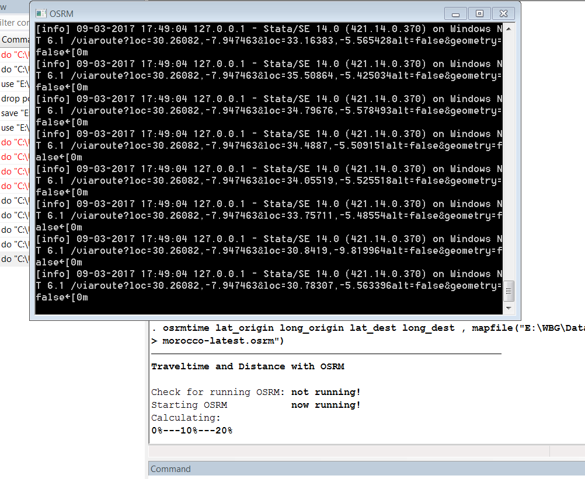

# Travel times between any points with Stata

### Purpose
This do script uses the [osrmtime command](Calculate_Travel_Time_and_Distance_with_OpenStreetMap_Data_Using_the_Open_Source_Routing_Machine_OSRM.pdf), which makes use of the [Open Source Routing Machine](http://project-osrm.org/) ([GitHub](https://github.com/Project-OSRM)) and [OSM](https://www.openstreetmap.org) roads, in Stata to calculate travel times between any points. The script is set up to create a travel time matrix with travel times and distances between all origin and destination pairs.

In addition, the script uses the travel time matrix output and population data to calculate **'Market Potential'** measures with a few different definitions.

### Background
The example used in this case is Ugandan subcounties (center points) from 2014. The script first imports the coordinates of the subcounty shapefile and converts it to Stata format. In order to calculate travel times, the roads must be downloaded prior to running the script. [Roads for Uganda]( http://download.geofabrik.de/africa/uganda.html) (or your country of interest) can be downloaded from [Geofabrik](www.geofabrik.de).

In order to run this script you need to have Stata installed on your computer and the coordinates of the points of interest you want to calculate travel times to/from.


### Script explanation
*OBS. Always set the path according to your own directory. Find and replace [working path] and [country] with the correct values for your data.*

Start by installing osrmtime in Stata. You only need to do this once.
```
net install osrmtime, from("http://www.uni-regensburg.de/wirtschaftswissenschaften/vwl-moeller/medien/osrmtime")

net get osrmtime, from("http://www.uni-regensburg.de/wirtschaftswissenschaften/vwl-moeller/medien/osrmtime")
```
If the above link doesn't work, download [osrmtime_online.zip](osrmtime_online.zip) and install directly yourself. Furthermore, if you have not already, you will need to install these other packages:

```
ssc install spmap
ssc install shp2dta
ssc install mif2dta
shell osrminstall.cmd
```
You have to "prepare the map" for your country (you must have  already downloaded the OSM data from Geofabrik (or other source) and put it in your working directory: [country]-latest.osm.pbf). Note that we use `car` as the profile in order to calculate driving times. It is also possible to calculate travel times for other modes of transportation such as bicycle and walking (check the [osrmtime documentation](Calculate_Travel_Time_and_Distance_with_OpenStreetMap_Data_Using_the_Open_Source_Routing_Machine_OSRM.pdf) for more information).
```
osrmprepare, mapfile("[working path]\[country]\[country]-latest.osm.pbf") profile(car)
```
For our example, we want to calculate the travel times between all subcounties in Uganda. We have placed a Uganda subcounty shapefile containing the longitude and latitudes (in decimal degrees) of the subcounty centroids in our working directory.

We start off by importing the shapefile to Stata and save to identical datasets, one for origin subcounties and the other for destination subcounties.

```
clear
cd [working path]\[country]
shp2dta using [shapefile], data("subC")  coor("SubC_coord")
use subC.dta
keep OBJECTID Lat Long POP2014 /*keep only the necessary variables*/
rename Lat lat_origin
rename Long long_origin
rename OBJECTID IDsubC_origin
rename POP2014 POP2014_origin
save subCorigin.dta, replace /*you want one origin dataset...*/
rename lat_origin lat_dest
rename long_origin long_dest
rename IDsubC_origin IDsubC_dest
rename POP2014_origin POP2014
save subCdest.dta, replace /*and one destination dataset (even though they are exactly the same)*/
```
`Cross` the origin dta with the destination dta in order to create a matrix dataset with pairwise combinations between ALL origins and ALL destinations. This will be the final dataset ready for osrmtime.
```
use subCorigin.dta, clear
cross using subCdest.dta
```
Next, run `osrmtime` to calculate travel times and distances between all subcounties. We also both display and add timestamps as variables before and after the osrmtime calculations to keep track of how long it takes. For our 1437 Uganda subcounties (1437*1437=2,064,969 combinations), the calculations took about 12 hours using StataSE 14 (in addition to number of points, the time will depend on size of your area, version of Stata, and your computer specs). Make sure you save the dataset after osrmtime.
```
display "$S_TIME  $S_DATE" /*Display the start time*/
gen datetime_start="$S_TIME  $S_DATE" /*create a new timestamp variable with starting time */
osrmtime lat_origin long_origin lat_dest long_dest , mapfile("[working path]\[country]\[country]-latest.osrm")
display "$S_TIME  $S_DATE" /*Display the end time*/
gen datetime_end="$S_TIME  $S_DATE" /*create a new timestamp variable with ending time */
save subC_origin_dest.dta, replace
```
Your Stata display should look similar to the screenshot below while osrmtime is running (in the screenshot, osrmtime is running for Morocco, not Uganda).


Once the process is done, your Stata data editor should look similar to this:


**distance** is the travel distance between the two locations in meters and **duration** is the travel time between the two locations in seconds. **jumpdist1** is the Euclidean distance the origin point had to be 'snapped' to the road network and conversely **jumpdist2** is the Euclidean distance the destination point had to be 'snapped' to the road network.

#### Market potential
The next part of the script calculates market potential for Ugandan subcounties. We use information on population per subcounty as well as travel times between subcounties for this purpose. This measure could also be called 'accessibility to the population'. It represents the population that can be reached from each subcounty weighted by travel time to the other subcounties.

To simplify, generate distance and duration variables in KM and hours. Add on the 'snapping distances'. The way these are added on to the total distance and duration is up to the author. Label variables.
```
gen distKM=(distance+jumpdist1*6+jumpdist2*6)/1000   /*these calculations are arbitrary, my choice to calculate total travel distance this way*/
replace distKM=0 if distance==0
gen distHour=(duration+jumpdist1/10+jumpdist2/10)/3600 /*these calculations are arbitrary, my choice to calculate total travel time this way*/
replace distHour=0 if duration==0
label var IDsubC_origin "Origin ID"
label var IDsubC_dest "Destination ID (subcounty)"
label var distKM "Distance from origin to destination in km"
label var distHour "Travel time from origin to destination in hours"
label var POP2014 "Population 2014 of destination subcounty"
rename POP2014 POP
```
Order the variables in desired order.
```
order IDsubC_origin IDsubC_dest distance duration jumpdist1 jumpdist2 distKM distHour POP, first
```
We calculate a few different versions of market potential using different distance discount factors and both with the inclusion of the 'own' subcounty in the population sum calculation and without the own subcounty.

The first market potential measure is 'AccessSomik' which makes use of the size of the country to determine the distance discounting factor.
```
gen AccessSomik= POP*exp(-distHour/450) /* 2*a^2=450, a= maximum distance possible across the country: 15h*/
```
The next set of market potential variables are calculated with a few different distance discounting factors.
```
gen MP005= POP*exp(-0.05*distHour)
gen MP01= POP*exp(-0.1*distHour)
gen MP05= POP*exp(-0.5*distHour)
gen MP1= POP*exp(-1*distHour)
gen MP3p8= POP*exp(-3.8*distHour)
gen MP5= POP*exp(-5*distHour)
gen MP7p5= POP*exp(-7.5*distHour)
```
The next set of market potential variables mirror the ones above, but this time the own subcounty is excluded from the calculations.
```
gen own =0
replace own=1 if IDsubC_origin==IDsubC_dest
gen MPdom005= POP*exp(-0.05*distHour) if own==0
gen MPdom01= POP*exp(-0.1*distHour) if own==0
gen MPdom05= POP*exp(-0.5*distHour) if own==0
gen MPdom1= POP*exp(-1*distHour) if own==0
gen MPdom3p8= POP*exp(-3.8*distHour) if own==0
gen MPdom5= POP*exp(-5*distHour) if own==0
gen MPdom7p5= POP*exp(-7.5*distHour) if own==0
```
Finally, sum up the MP variables over subcounty with the `collapse (sum)` command.
```
collapse (sum) AccessSomik MP005 MP01 MP05 MP1 MP3p8 MP5 MP7p5 MPdom005 MPdom01 MPdom05 MPdom1 MPdom3p8 MPdom5 MPdom7p5, by(IDsubC_origin)
```
Label variables.
```
label var IDsubC_origin "Origin subcounty ID"
label var AccessSomik "Market Potential (access to pop) using OSM 03-23-2017, a:15, Somik definition"
label var MP005 "Market Potential (access to pop) using OSM March 2017, lambda:0.005"
label var MP01 "Market Potential (access to pop) using OSM March 2017, lambda:0.01"
label var MP05  "Market Potential (access to pop) using OSM March 2017, lambda:0.5"
label var MP1  "Market Potential (access to pop) using OSM March 2017, lambda:1"
label var MP3p8  "Market Potential (access to pop) using OSM March 2017, lambda:3.8"
label var MP5  "Market Potential (access to pop) using OSM March 2017, lambda:5"
label var MP7p5 "Market Potential (access to pop) using OSM March 2017, lambda:7.5"

label var MPdom005 "Market Potential excluding own (access to pop) using OSM March 2017, lambda:0.005"
label var MPdom01 "Market Potential excluding own (access to pop) using OSM March 2017, lambda:0.01"
label var MPdom05  "Market Potential excluding own (access to pop) using OSM March 2017, lambda:0.5"
label var MPdom1  "Market Potential excluding own (access to pop) using OSM March 2017, lambda:1"
label var MPdom3p8  "Market Potential excluding own (access to pop) using OSM March 2017, lambda:3.8"
label var MPdom5  "Market Potential excluding own (access to pop) using OSM March 2017, lambda:5"
label var MPdom7p5 "Market Potential excluding own (access to pop) using OSM March 2017, lambda:7.5"
```
Save the dataset and export as excel for easy import to GIS software.
```
save MP_OSM_subC.dta, replace
export excel using "[working path]\[country]\[country]GIS\MP_OSM_UgsubC.xlsx", firstrow(variables) replace
```
You can now make a pretty map of the results. The map below shows the variable **MP05** (market potential with a distance discounting factor set to 0.5).

